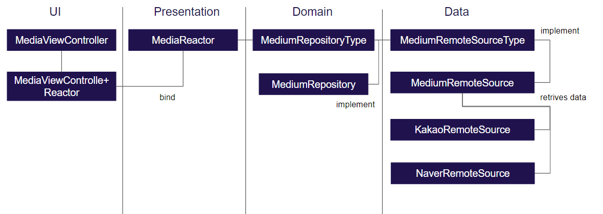
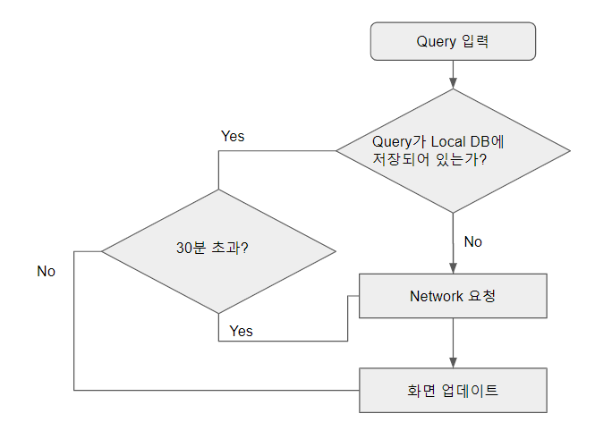
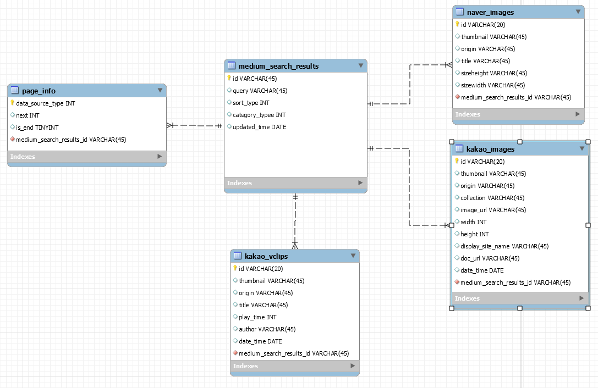

# TylerQuickMedia


네이버, 카카오의 이미지, 동영상을 빠르게 검색하는 앱입니다.

"**기술 놀이터**"로써 Swift, iOS, Library 들을 활용해보고 학습하기 위한 저장소입니다.

## 데모


## Languages, libraries and tools used

* [Swift](https://developer.apple.com/kr/swift/)
* [RxSwift](https://github.com/ReactiveX/RxSwift)
* [SwiftLint](https://github.com/realm/SwiftLint)
* [SwiftGen](https://github.com/SwiftGen/SwiftGen)
* [SnapKit](https://github.com/SnapKit/SnapKit)
* [Storyboard](https://developer.apple.com/library/archive/documentation/UserExperience/Conceptual/AutolayoutPG/index.html)
* [Moya](https://github.com/Moya/Moya)
* [Swinject](https://github.com/Swinject/Swinject)
* [Kingfisher](https://github.com/onevcat/Kingfisher)
* [Realm](https://realm.io/kr/docs/swift/latest/)
* [Hero](https://github.com/HeroTransitions/Hero)
* [SwiftyBeaver](https://github.com/SwiftyBeaver/SwiftyBeaver)
* [IGListKit](https://github.com/Instagram/IGListKit)
* [ReactorKit](https://github.com/ReactorKit/ReactorKit)
* [Then](https://github.com/devxoul/Then)
* [Firebase](https://firebase.google.com/docs/ios/setup?hl=ko)
* [Quick](https://github.com/Quick/Quick)
* [Nimble](https://github.com/Quick/Nimble)

## 아키텍처 
[ReactorKit](https://github.com/ReactorKit/ReactorKit)를 활용하여 MVI (Model-View-Inent) 패턴을 사용합니다.

* [MediaReactor.swift](TylerQuickMedia/UI/Media/MediaReactor.swift) 
* [MediaViewController+Reactor.swift](TylerQuickMedia/UI/Media/MediaViewController+Reactor.swift)

[Reactor TestCase](TylerQuickMediaTests/MediaReactorTest.swift)

### UI
iOS Framework를 사용하며 화면에 표시되는 모든 UI 구성 요소를 만드는 데 사용됩니다.
### Presentation
UI의 Input과 Output 사이의 일련의 과정을 책임집니다.
### Domain
Data(Local DB, Network) layer로 부터 데이터를 검색하고 Presentation layer로 전달합니다.
### Data
Data layer는 외부 Data layer에 대한 Access point(Local DB, Network) 입니다.

## [Realm](https://realm.io/kr/docs/swift/latest/) with swift
### FlowChart 

### DataModels


### Codes
* [NaverImage.swift](TylerQuickMedia/Model/Persistence/NaverImage.swift) 
> [API 가이드](https://developers.naver.com/docs/search/image/)
* [KakaoImage.swift](TylerQuickMedia/Model/Persistence/KakaoImage.swift)
> [API 가이드](https://developers.kakao.com/docs/restapi/search#이미지-검색)
* [KakaoVclip.swift](TylerQuickMedia/Model/Persistence/KakaoVclip.swift) 
> [API 가이드](https://developers.kakao.com/docs/restapi/search#동영상-검색)

* [MediumSearchResult.swift](TylerQuickMedia/Model/Persistence/MediumSearchResult.swift)
* [NextInfo.swift](TylerQuickMedia/Model/Persistence/NextInfo.swift)

## Network
[Moya](https://github.com/Moya/Moya)를 활용한 API 구성
### [NaverApi](TylerQuickMedia/Network/Api/NaverApi.swift)
```swift
extension NaverApi: TargetType {
    var baseURL: URL { return URL(string: "https://openapi.naver.com")! }
    var path: String {
        switch self {
        case .image:
            return "/v1/search/image"
        }
    }
    var method: Moya.Method {
        switch self {
        case .image:
            return .get
        }
    }
}
```
### [KakaoApi](TylerQuickMedia/Network/Api/KakaoApi.swift)
```swift
extension KakaoApi: TargetType {
    var baseURL: URL { return URL(string: "https://dapi.kakao.com")! }
    var path: String {
        switch self {
        case .image:
            return "/v2/search/image"
        case .vclip:
            return "/v2/search/vclip"
        }
    }
    var method: Moya.Method {
        switch self {
        case .image, .vclip:
            return .get
        }
    }
}

```
### 인증토큰 등록
MoyaProvider를 생성하면서 Plugin을 등록합니다.
```swift
   let naverProvider = MoyaProvider<NaverApi>(
        callbackQueue: moyaSchduler,
        manager: DefaultAlamofireManager.sharedManager,
        plugins: moyaPlugins)
```
```swift
public struct AccessTokenPlugin: PluginType {
    public func prepare(_ request: URLRequest, target: TargetType) -> URLRequest {
        guard let authorizable = target as? AccessTokenAuthorizable else { return request }
        
        let authorizationType = authorizable.authorizationType
        
        var request = request
        
        switch authorizationType {
        case .kakaoAk:
            let value = "\(authorizationType.rawValue) \(Enviroment.Kakao.API_KEY)"
            request.addValue(value, forHTTPHeaderField: "Authorization")
        case .none:
            break
        case .naver:
            request.addValue(Enviroment.Naver.CLIENT_ID, forHTTPHeaderField: "X-Naver-Client-Id")
            request.addValue(Enviroment.Naver.CLIENT_SECRET, forHTTPHeaderField: "X-Naver-Client-Secret")
        }
        
        return request
    }
}
```
### 네트워크 요청
[KakaoRemoteSource.swift](TylerQuickMedia/Service/KakaoRemoteSource.swift) 아래의 요청은 카카오 API 를 호출하는 예제입니다.

[TestCase](TylerQuickMediaTests/KakaoRemoteSourceTest.swift)
> total page를 사전에 알 수 없기 때문에 **`catchHitEnd`** error handling 으로 total page 를 설정
```swift
 func searchVclip(_ param: KakaoMediumRequest) -> Single<KakaoVClipResponse> {
        logger.info("\(getThreadName())")
        return self.provider.rx.request(.vclip(param))
            .do(onSuccess: { _ in
                logger.info("\(getThreadName())")
            })
            .network()
            .catchHitEnd({
                Single.just(KakaoVClipResponse(meta: Meta.INSTANCE_END, documents: []))
            })
    }
```
```swift
private extension PrimitiveSequence where TraitType == SingleTrait {
    func catchHitEnd(_ concreateType: @escaping () -> PrimitiveSequence<SingleTrait, Element>) -> PrimitiveSequence<SingleTrait, Element> {
        return self.catchError({ error in
            if let moyaError = error as? MoyaError {
                let res = moyaError.response
                let errorData = try res?.map(KakakoErrorData.self)
                if res?.statusCode == 400 && errorData?.errorType == KakaoErrors.hitEnd.rawValue {
                    return concreateType()
                }
            }
            throw error
        })
    }
}

```
[MediumRemoteSource.swift](TylerQuickMedia/Service/MediumRemoteSource.swift)는 네트워크 요청 할 경우 CategoryType, SortType을 결정합니다.

[TestCase](TylerQuickMediaTests/MediumRemoteSourceTest.swift)
> * CategoryType [KakaoImage, KakaoVClip, NaverImage]
> * SortType [Accuracy, Recency]
